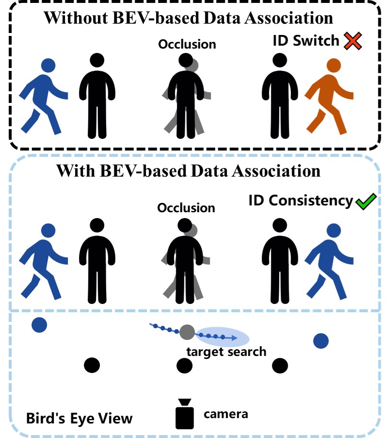
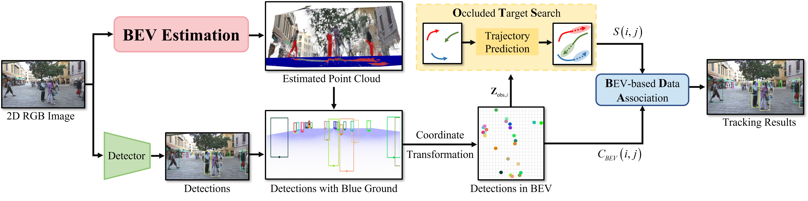

# EBEVTrack🐦
 [](https://opensource.org/licenses/MIT) 

#### EBEVTrack is a simple and strong multi-object tracker.💪

> **EBEVTrack: Estimated Bird's-Eye View for Multi-Object Tracking**

## Abstract📘

Multi-object tracking (MOT) is a fundamental task in computer vision that requires accurately detecting and continuously tracking multiple targets across video frames. However, existing methods struggle with objects that have similar appearances or are occluded. Bird’s-Eye View (BEV) can reduce perspective distortion and provide spatial consistency, but traditional implementations usually rely on complex 3D perception or multi-camera systems. To address these limitations, we propose EBEVTrack, a novel online tracker that estimates BEV from monocular 2D images. Specifically, we design two key strategies: BEV-based Data Association (BDA), which links targets using their spatial relationships in the BEV coordinate system, and Occluded Target Search (OTS), which reduces false trajectories and identity switches by handling occluded targets. Extensive experiments on MOT17 and MOT20 demonstrate that EBEVTrack achieves superior robustness and accuracy. The source code and data are available at: https://github.com/zhengpangzi/EBEVTrack.
<p align="center"></p>

### Highlights💡

- We propose **EBEVTrack**, a novel multi-object tracking framework that integrates **Estimated Bird’s-Eye View (EBEV)** into data association.
- We design a **BEV-based Data Association (BDA)** strategy that exploits spatial geometric consistency in BEV space to improve trajectory matching.
- We introduce an **Occluded Target Search (OTS)** strategy that predicts and searches for occluded targets in BEV space, reducing false trajectories and ID switches.
- Experiments on MOT17 and MOT20 verify the **effectiveness** and **generalization** of the proposed approach.

###  Pipeline of EBEVTrack✔️

<p align="center"></p>

## Tracking performance📈

### Results on MOT17 challenge test set

| Tracker          | HOTA↑ | IDF1↑ | MOTA↑ |
| :--------------- | :--: | :--: | :--: |
| ByteTrack          | 63.1 | 77.3 | 80.3 |
| EBEVTrack      | **64.3(+1.2)** | **78.6(+1.3)** | 79.9|

### Results on MOT20 challenge test set

| Tracker          | HOTA↑ | IDF1↑ | MOTA↑ |
| :--------------- | :--: | :--: | :--: |
| ByteTrack      | 61.3 | 75.2 | 77.8 |
| EBEVTrack | **63.1(+1.8)** | **76.8(+1.6)** | 76.5 |

### Visualization results on MOT challenge test set

## Installation✅

Step1. Install EBEVTrack.

```shell
git clone https://github.com/zhengpangzi/EBEVTrack.git
cd EBEVTrack
pip3 install -r requirements.txt
python3 setup.py develop
```

Step2. Install [pycocotools](https://github.com/cocodataset/cocoapi).

```shell
pip3 install cython; pip3 install 'git+https://github.com/cocodataset/cocoapi.git#subdirectory=PythonAPI'
```

Step3. Others

```shell
pip install cython_bbox pandas xmltodict
```


<!-- Step2.  BEV Estimation

```shell

``` -->

<!-- Step3. BEV-based Data Association (BDA) Installation

```shell

``` -->

Step4. Install Occluded Target Search (OTS)

```shell
cd EBEVTrack/ots
pip3 install -r requirements.txt
```

## Data preparation📁

1. Download [MOT17](https://motchallenge.net/), [MOT20](https://motchallenge.net/), [CrowdHuman](https://www.crowdhuman.org/), [Cityperson](https://github.com/Zhongdao/Towards-Realtime-MOT/blob/master/DATASET_ZOO.md), [ETHZ](https://github.com/Zhongdao/Towards-Realtime-MOT/blob/master/DATASET_ZOO.md), [DanceTrack](https://github.com/DanceTrack/DanceTrack), [CUHKSYSU](http://www.ee.cuhk.edu.hk/~xgwang/PS/dataset.html) and put them under <EBEVTRACK_HOME>/datasets in the following structure.

```text
📁datasets
   ├─📁mot
   │   ├─📁train
   │   └─📁test
   │
   ├─📁crowdhuman
   │   ├─📁Crowdhuman_train
   │   ├─📁Crowdhuman_val
   │   ├─📄annotation_train.odgt
   │   └─📄annotation_val.odgt
   │
   ├─📁MOT20
   │   ├─📁train
   │   └─📁test
   │
   ├─📁Cityscapes
   │   ├─📁images
   │   └─📁labels_with_ids
   │
   ├─📁ETHZ
   │   ├─📁eth01
   │   ├─📁...
   │   └─📁eth07
   │
   ├─📁CUHKSYSU
   │   ├─📁images
   │   └─📁labels_with_ids
   │
   └─📁dancetrack
       ├─📁train
       │   └─📄train_seqmap.txt
       ├─📁val
       │   └─📄val_seqmap.txt
       └─📁test
           └─📄test_seqmap.txt        
```

For a fairer comparison, the detection model is kept consistent with the baseline algorithm.

## Model zoo 🐦︎

Download and store the trained models in 'pretrained' folder as follow:

```
<EBEVTrack_HOME>/pretrained
```

### Detection Model

#### Ablation model

| Dataset| Model |
|---------|-|
|EBEVTrack_ablation |[[google]](https://drive.google.com/file/d/1iqhM-6V_r1FpOlOzrdP_Ejshgk0DxOob/view?usp=sharing), [[baidu(code:eeo8)]](https://pan.baidu.com/s/1W5eRBnxc4x9V8gm7dgdEYg)

#### MOT17 test model

| Dataset| Model |
|---------|-|
|EBEVTrack_mot17&nbsp;&nbsp;&nbsp;|[[google]](https://drive.google.com/file/d/1P4mY0Yyd3PPTybgZkjMYhFri88nTmJX5/view?usp=sharing), [[baidu(code:ic0i)]](https://pan.baidu.com/s/1OJKrcQa_JP9zofC6ZtGBpw)&nbsp;&nbsp; 

#### MOT20 test model

| Dataset    | Model |
|------------|-|
|EBEVTrack_mot20|[[google]](https://drive.google.com/file/d/1HX2_JpMOjOIj1Z9rJjoet9XNy_cCAs5U/view?usp=sharing), [[baidu(code:3apd)]](https://pan.baidu.com/s/1bowJJj0bAnbhEQ3_6_Am0A) &nbsp;

## Training🚀

### Train the Detection Model

You can use EBEVTrack without training by adopting existing detectors. But we borrow the training guidelines from ByteTrack in case you want work on your own detector. 

Download the COCO-pretrained YOLOX weight [here](https://github.com/Megvii-BaseDetection/YOLOX/tree/0.1.0) and put it under *\<EBEVTRACK_HOME\>/pretrained*.

* **Train ablation model (MOT17 half train and CrowdHuman)**

  ```shell
  python3 tools/train.py -f exps/example/mot/yolox_x_ablation.py -d 8 -b 48 --fp16 -o -c pretrained/yolox_x.pth
  ```

* **Train MOT17 test model (MOT17 train, CrowdHuman, Cityperson and ETHZ)**

  ```shell
  python3 tools/train.py -f exps/example/mot/yolox_x_mix_det.py -d 8 -b 48 --fp16 -o -c pretrained/yolox_x.pth
  ```

* **Train MOT20 test model (MOT20 train, CrowdHuman)**

  For MOT20, you need to uncomment some code lines to add box clipping: [[1]](https://github.com/ifzhang/ByteTrack/blob/72cd6dd24083c337a9177e484b12bb2b5b3069a6/yolox/data/data_augment),[[2]](https://github.com/ifzhang/ByteTrack/blob/72cd6dd24083c337a9177e484b12bb2b5b3069a6/yolox/data/datasets/mosaicdetection.py#L122),[[3]](https://github.com/ifzhang/ByteTrack/blob/72cd6dd24083c337a9177e484b12bb2b5b3069a6/yolox/data/datasets/mosaicdetection.py#L217) and [[4]](https://github.com/ifzhang/ByteTrack/blob/72cd6dd24083c337a9177e484b12bb2b5b3069a6/yolox/utils/boxes.py#L115). Then run the command:

  ```shell
  python3 tools/train.py -f exps/example/mot/yolox_x_mix_mot20_ch.py -d 8 -b 48 --fp16 -o -c pretrained/yolox_x.pth
  ```

* **Train on DanceTrack train set**

  ```shell
  python3 tools/train.py -f exps/example/dancetrack/yolox_x.py -d 8 -b 48 --fp16 -o -c pretrained/yolox_x.pth
  ```

* **Train custom dataset**

  First, you need to prepare your dataset in COCO format. You can refer to [MOT-to-COCO](https://github.com/ifzhang/ByteTrack/blob/main/tools/convert_mot17_to_coco.py) or [CrowdHuman-to-COCO](https://github.com/ifzhang/ByteTrack/blob/main/tools/convert_crowdhuman_to_coco.py). Then, you need to create a Exp file for your dataset. You can refer to the [CrowdHuman](https://github.com/ifzhang/ByteTrack/blob/main/exps/example/mot/yolox_x_ch.py) training Exp file. Don't forget to modify get_data_loader() and get_eval_loader in your Exp file. Finally, you can train bytetrack on your dataset by running:

  ```shell
  python3 tools/train.py -f exps/example/mot/your_exp_file.py -d 8 -b 48 --fp16 -o -c pretrained/yolox_x.pth
  ```
## Tracking🎯

* **Evaluation on MOT17 half val**
  
Run EBEVTrack:

```shell
cd <EBEVTrack_HOME>
python3 tools/track.py -f exps/example/mot/yolox_x_ablation.py -c pretrained/ebevtrack_ablation.pth.tar -b 1 -d 1 --fp16 --fuse
```

- **Test on MOT17**
  
Run EBEVTrack:

```shell
cd <EBEVTrack_HOME>
python3 tools/track.py -f exps/example/mot/yolox_x_mix_det.py -c pretrained/ebevtrack_x_mot17.pth.tar -b 1 -d 1 --fp16 --fuse
```

- **Test on MOT20**

Run EBEVTrack:

```shell
cd <EBEVTrack_HOME>
python3 tools/track.py -f exps/example/mot/yolox_x_mix_mot20_ch.py -c pretrained/ebevtrack_x_mot20.pth.tar -b 1 -d 1 --fp16 --fuse --mot20
```

### Demo

```shell
cd <EBEVTrack_HOME>
python3 tools/demo_track.py video -f exps/example/mot/yolox_x_mix_det.py -c pretrained/ebevtrack_x_mot17.pth.tar --fp16 --fuse --save_result
```

## Acknowledgement🤝

A large part of the code is borrowed from [YOLOX](https://github.com/Megvii-BaseDetection/YOLOX), [ByteTrack](https://github.com/ifzhang/ByteTrack), [BoT-SORT](https://github.com/NirAharon/BOT-SORT) and [FastReID](https://github.com/JDAI-CV/fast-reid). Many thanks for their wonderful works.

## Citation🤗

If you find our work useful for your research, please consider citing:

```
BibTeX Entry Goes Here (will update in the future)
```