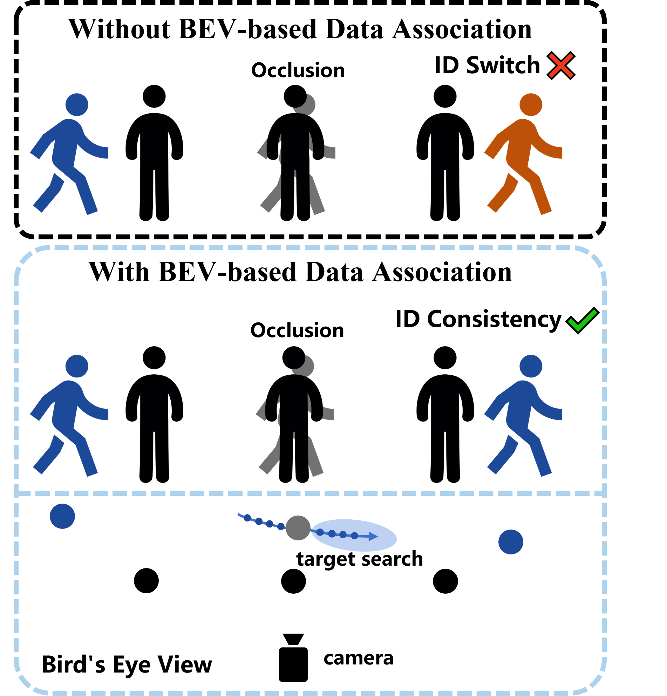

# EBEVTrack

#### EBEVTrack is a simplet and strong multi-object tracker.

> [**EBEVTrack: Estimated Bird's-Eye View for Multi-Object Tracking**](https://arxiv.org/abs/2110.06864)
> 
> Yitao Zheng, Xiwen Ren, Youbin Zhao, Dongdong Yu, Ping Zhang*
> 
## Abstract
Multi-object tracking (MOT) is a fundamental task in computer vision that requires accurately detecting and continuously tracking multiple targets across video frames. However, existing methods struggle with objects that have similar appearances or are occluded. Bird’s-Eye View (BEV) can reduce perspective distortion and provide spatial consistency, but traditional implementations usually rely on complex 3D perception or multi-camera systems. To address these limitations, we propose EBEVTrack, a novel online tracker that estimates BEV from monocular 2D images. Specifically, we design two key strategies: BEV-based Data Association (BDA), which links targets using their spatial relationships in the BEV coordinate system, and Occluded Target Search (OTS), which reduces false trajectories and identity switches by handling occluded targets. Extensive experiments on MOT17 and MOT20 demonstrate that EBEVTrack achieves superior robustness and accuracy. The source code and data are available at: https://github.com/zhengpangzi/EBEVTrack.
<p align="center"></p>

## News

## Tracking performance
### Results on MOT challenge test set

| Dataset    |  HOTA | IDF1 | MOTA |
|------------|-------|------|------|
|MOT17       | 64.3 | 78.6 | 79.9 |
|MOT20       | 63.1 | 76.8 | 76.5 |

### Visualization results on MOT challenge test set

## Installation
Step1. Install EBEVTrack.
```shell
git clone https://github.com/zhengpangzi/EBEVTrack.git
cd EBEVTrack
pip3 install -r requirements.txt
python3 setup.py develop
```
   


   
Step2. Install pycocotools.
```shell
pip3 install cython; pip3 install 'git+https://github.com/cocodataset/cocoapi.git#subdirectory=PythonAPI'
```
Step3. Others
```shell
pip3 install cython_bbox
```